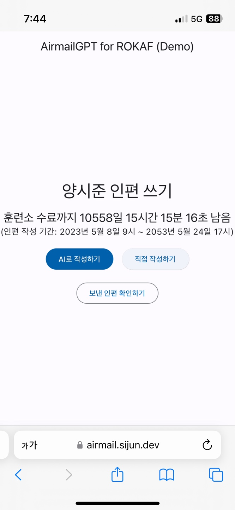

# AirmailGPT for ROKAF

## 개요
- 공군 기본군사훈련단 인터넷편지 작성 경험을 향상시키는 웹 애플리케이션 개발 프로젝트
- Demo 버전(Web): https://airmail.sijun.dev/

## 기능
1. 공군 기본군사훈련단 인터넷편지 대대 접근성 좋은 모바일 웹 및 PWA 지원
2. 지정한 키워드 기반을 편지 초안을 작성해주는 AI 기능 (GPT-3.5)
3. 받는 사람 생년월일과 보내는 사람 주소 입력을 생략하여 인터넷편지 작성 과정 간소화
4. 공군 기본군사훈련단 웹사이트의 잦은 오류 발생 대비 인터넷편지 웹사이트 접속 불가 시 DB에 저장해뒀다가 나중에 자동 재전송 시도하는 기능 지원
5. 사전 설정에 따라 스포츠 리그의 경기 결과 및 순위표, 지정한 팀의 상세 경기정보를 매일 지정된 시간에 자동 전송

## 사용한 기술 스택
- Flutter, Spring Boot (Kotlin), Node.js, Puppeteer, MySQL, Docker

## 스크린샷

### 1. 기존 공군 기본군사훈련단 인터넷편지 홈페이지

(모바일 전용 웹 없음)

### 2. 메인 페이지

### 3. AI로 작성하기

### 4. 직접 작성하기

### 5. PWA 아이콘

### 6. PWA 실행화면
